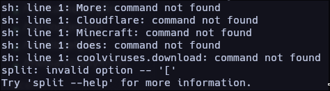
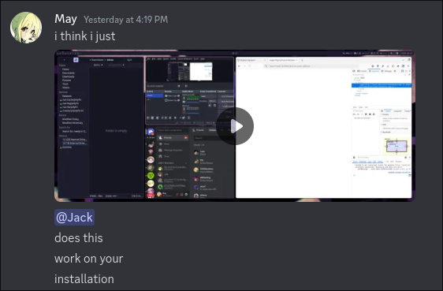
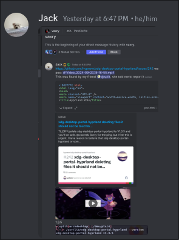

import Demo from "./demo.astro"

Hey all.

I've been wasting a ton of time on Satisfactory ever since 1.0 released and kind of doing absolutely nothing else.
<small>I should really write *some* code again.</small>

As of writing, I'm on Tier 6, and in the middle of building a railway. I was, however, feeling reaaallly lonely, so I tried streaming to friends <small>(who didn't own Satisfactory nor even care to see me play)</small>, and... Vesktop just crashed.

Of course, my brain immediately shot to either my system or Vesktop being out of date. On my desktop, I use the Vesktop flatpak, so
I performed both a full system update <small>(which I had already just done, like, the day before)</small> and ran `flatpak update`.

Turns out Vesktop wasn't out of date. Whatever. Probably fixed now. So I tried again, and... Vesktop still crashed as soon as I dared click the screenshare button.

Cool! Alright. Time to mull over logs. :onimai.mihari.Tired:

Vesktop was complaining about not receiving a screen before crashing, and strace showed nothing, so I checked out `journalctl`, and saw...

...an `sh` syntax error under `xdg-desktop-portal-hyprland`?

Weird. I read the triggering line, and thought that it was probably some Firefox window, so I closed the tabs of any Firefox window I had open with parentheses in the title, and got a different error:

Oh. Huh. Those are just... random select words from my browser's tabs.

Okay, so surely it wouldn't work if I just... *closed* Firefox, right?

...right?

...Nope. It worked without Firefox. I read the syntax error line again, and then it hit me. So I tried something.

    <video src="/blog/hyprland-vulnerability/initialtest.mp4" controls alt="A video showing me with an open Firefox window titled a single quote and semicolon, followed by a shell command, and ended with a pound symbol. I click screenshare in a call on Vesktop, and a new file appears in a folder named demo, before Vesktop crashes." />

Oh! Okay! That... shouldn't happen!

At this point, I was still confused. I had assumed it was a Vesktop vulnerability, but I wasn't so sure. So I quickly decided to ask [Jack](https://jack.cab) if he could reproduce.

And he couldn't. Now we were even more confused. I was... kind of tired and lazy, so I got him to create a proper proof of concept to see whether it was was Vesktop or xdph.

    <video src="/blog/hyprland-vulnerability/poc1.mp4" controls alt="Proof of concept. A webpage with a button saying 'Hack me'. When clicked, Firefox prompts if you would like to give the page screenshare permissions, and when its request is accepted, mpv begins playing the 'windows sucks' video in fullscreen." />

Okay, so it's xdph. Cool!

At this point, we realized that we should probably report this, so we switched out mpv for a notification:

...and proceeded to send it to Vaxry to get fixed.

Anyway: 6 hours before the writing of this post, [xdph v1.3.6](https://github.com/hyprwm/xdg-desktop-portal-hyprland/releases/tag/v1.3.6) was released, fixing this vulnerability. I obviously heavily recommend that you update.
If you haven't updated, though, and would like to try this out yourself:
<Demo />

    <small>note: this apparently doesn't work on NixOS. I have no idea why. Also, you'll need `mpv`.</small>

